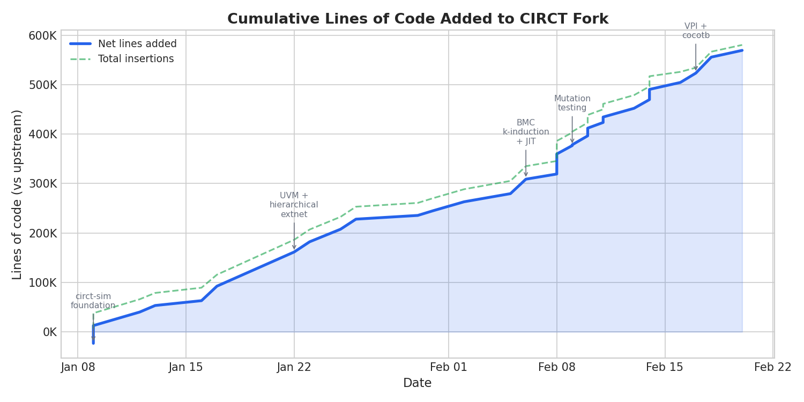
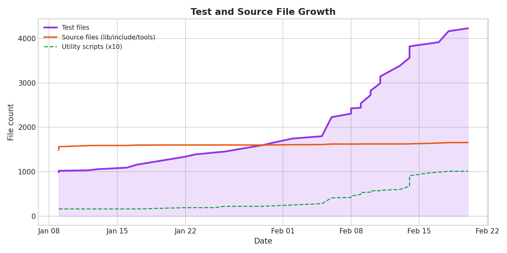

# Building an Open-Source Verilog Simulator with AI: 580K Lines in 43 Days

Commercial Verilog simulators can cost hundreds of thousands of dollars per seat per year.
For most hardware teams, these tools are the single largest line item in their EDA budget — and yet the core algorithms are well-understood, the specifications are public (IEEE 1800-2017), and open-source compiler infrastructure like [CIRCT](https://circt.llvm.org/) already exists.

What if you could close the gap with agentic AI?

Over 43 days in January and February 2026, I used Claude and Codex to land **2,968 commits** on a CIRCT fork — adding a full event-driven simulator, VPI/cocotb integration, UVM runtime support, bounded model checking, logic equivalence checking, and mutation testing.
The result is a practical, open-source verification stack that can simulate real-world protocol testbenches end-to-end.

This post is a technical account of what happened, what the numbers look like, and what I think it means.

---

## What is CIRCT, and What Was Missing?

[CIRCT](https://circt.llvm.org/) (Circuit IR Compilers and Tools) is an LLVM/MLIR-based infrastructure for hardware design and verification.
It provides a rich set of intermediate representations — HW, Comb, Seq, LLHD, Moore — and tools for parsing Verilog (`circt-verilog`, powered by [slang](https://github.com/MikePopoloski/slang)), optimizing IR (`circt-opt`), and basic formal checking (`circt-bmc`, `circt-lec`).

What it did *not* have was a practical simulation runtime.
You could parse Verilog into MLIR and lower it through various dialects, but you couldn't actually *run* a testbench.
There was no event-driven scheduler, no VPI layer, no UVM support, no waveform output, no cocotb integration.
The gap between "we can compile Verilog" and "we can simulate a design" was enormous.

Bridging that gap is exactly the kind of task where agentic AI shines: the specification is known (IEEE 1800), the interfaces are well-defined, and the work is largely *volume* — thousands of op handlers, system calls, edge cases — rather than fundamental research.

---

## The Timeline

The fork diverged from upstream CIRCT on **January 9, 2026** with a commit adding four-state logic support to the Arc dialect.
The last commit at time of writing is from **February 20** — 43 days later.

Here's how the features landed, week by week:

**Week 1 (Jan 9–12): Foundation**
- `circt-sim` event-driven simulation driver
- Four-state (0/1/X/Z) type system
- Coverage dialect
- DPI-C runtime infrastructure
- UVM randomization ops

**Week 2 (Jan 13–19): UVM Parity Push**
- UVM mailbox/semaphore primitives
- `randomize()` method support
- Constraint expressions
- AVIP (protocol verification IP) baseline — all 9 AVIPs compiling
- Z3/JIT linking for BMC/LEC

**Weeks 3–4 (Jan 20–Feb 2): SystemVerilog Completeness**
- Hierarchical net resolution
- `force`/`release`/`deassign` procedural statements
- UVM sequence/sequencer infrastructure
- sv-tests integration (22 tests passing, then rapidly growing)
- OpenTitan milestone: `gpio_reg_top` simulates end-to-end
- Verilator verification suite, yosys SVA tests at 78%

**Week 5 (Feb 3–9): Formal Verification + Mutation**
- BMC with k-induction and JIT compilation
- Unified formal regression harness
- Mutation testing framework (`circt-mut`)
- Native mutation campaign flow and quality reporting
- 800+ formal verification tests

**Weeks 6–7 (Feb 10–20): Cocotb, VPI, and Hardening**
- VPI C API implementation (IEEE 1364/1800)
- Cocotb integration with four-state signal support
- Arcilator behavioral lowering
- Unified regression orchestrator (40 lanes across 6 test suites)
- Comprehensive regression infrastructure

---

## By the Numbers

### Lines of Code

The fork adds **580,430 lines** across 3,846 files, with only 10,985 lines removed from upstream.
The growth was roughly linear at first, then accelerated sharply in February as the formal verification and mutation testing infrastructure went in.



The dip around Feb 16 is where we rebased onto a fresh upstream snapshot, which removed some upstream deletions from the diff.

### Commit Velocity

The pace started at ~25 commits/day in week 1 and peaked at **124 commits/day** in week 7 (Feb 10–16).
This isn't because the AI got faster — it's because the later work was more mechanical (regression infrastructure, test harnesses, quality gates) while the earlier work required more design iteration.


### Test Coverage

Test files grew from 987 (upstream baseline) to **4,229** — a 4.3x increase.
The fork added 3,208 new test files: 1,463 lit tests, 906 MLIR tests, and 785 SystemVerilog tests.



Note the inflection around Feb 6 — that's when the formal verification and mutation testing suites came online, adding hundreds of test cases in a few days.

### Where the Work Went

The 2,968 commits break down by area roughly as follows:


Formal verification (BMC + LEC) and mutation testing together account for ~30% of all commits — reflecting the substantial infrastructure needed for quality gates, baseline tracking, and regression management.

---

## How We Worked with AI

Every commit in this fork was written by one person — me.
But every commit was also co-authored by an AI system.


**Claude** (Anthropic) handled 54% of commits, primarily through Claude Code — an agentic coding tool that can read files, run tests, and iterate on implementations autonomously.
The split between Opus 4.5 (40%) and Opus 4.6 (14%) reflects model availability over the project timeline.

**Codex** (OpenAI) handled the remaining 46%, working in a complementary role.

The workflow was not "generate code, paste it in."
It was closer to pair programming with a very fast, very patient partner.
A typical iteration looked like:

1. I describe what needs to happen ("implement `$dumpvars` with VCD output")
2. The AI reads the relevant code, proposes an implementation, writes tests
3. Tests fail, the AI reads the failure output, iterates
4. Eventually the tests pass, I review the diff, commit

The project log records **1,554 iterations** of this cycle.
Many features took 3–5 iterations from first attempt to passing tests.
Some — particularly UVM sequencer integration and VPI callback handling — took 20+.

### What AI Was Good At

- **Op handlers**: CIRCT has dozens of MLIR operations that need lowering to simulation behavior.
  Writing the 50th `hw::ArrayGetOp` handler is tedious but well-specified.
  AI handles this effortlessly.

- **Test generation**: Given a feature spec and existing test patterns, AI generates thorough test cases faster than I could enumerate them.
  The 3,200+ new test files are almost entirely AI-generated.

- **Regression infrastructure**: Shell scripts for running test suites, parsing results, tracking baselines, retrying flaky tests.
  This is exactly the kind of boilerplate that AI produces reliably.

- **Debugging from error output**: When a test fails, the AI can read the MLIR dump, compare expected vs actual, and often identify the root cause faster than manual inspection.

### What AI Was Bad At

- **Architectural decisions**: The AI would happily implement whatever I asked for, even if the design was wrong.
  Choosing *where* to put the VPI layer, how to structure the event queue, when to use interpret vs JIT — these required human judgment.

- **Cross-cutting invariants**: When a change in the process scheduler affected both the VPI callback order and the UVM phase sequencer, the AI would fix one and break the other.
  Maintaining consistency across subsystems required constant human oversight.

- **Performance**: The AI optimizes for correctness, not speed.
  Several early implementations had O(n²) behavior that only surfaced on larger designs.

---

## What Works Today

Here's what you can actually *do* with this fork that you can't do with upstream CIRCT:

### Simulate a SystemVerilog Design

```bash
# Compile Verilog to MLIR
circt-verilog mydesign.sv -o mydesign.mlir

# Run event-driven simulation
circt-sim mydesign.mlir --top top_module --max-time 10000000
```

Upstream CIRCT can parse the Verilog, but has no production simulator.
This fork provides a full IEEE 1800-2017 event-driven simulator with four-state logic, VCD waveform output, and DPI-C support.

### Run cocotb Testbenches

```bash
# Run with cocotb via VPI
COCOTB_TEST_MODULES="my_test" \
COCOTB_TOPLEVEL="dut" \
circt-sim mydesign.mlir --top dut \
  --vpi "$COCOTB_ROOT/libs/libcocotbvpi_ius.so"
```

The VPI layer implements enough of the IEEE 1364/1800 C API for cocotb to discover signals, schedule callbacks, read/write values, and drive test sequences.
The cocotb regression suite covers 50+ test scenarios.

### Run UVM Testbenches (AVIP Protocol Suites)

The fork can run real UVM testbenches — not toy examples, but full protocol verification IP:

| Protocol | Master Coverage | Slave Coverage | Status |
|----------|----------------|----------------|--------|
| JTAG     | 100%           | 100%           | Passing |
| SPI      | 100%           | 100%           | Passing |
| AXI4     | 100%           | 96.5%          | Passing |
| AHB      | 90%            | 100%           | Passing |
| APB      | 87.9%          | 83.9%          | Passing |
| I2S      | —              | —              | Coverage collection issue |
| I3C      | —              | —              | Coverage collection issue |

5 of 7 protocols pass with meaningful coverage numbers.
This is a level of UVM support that doesn't exist in any other open-source simulator.

### Formal Verification

```bash
# Lower a testbench/design pair
circt-verilog counter.sv counter_tb.sv -o counter.mlir

# Run bounded model checking
circt-bmc counter.mlir --bound 20 --module counter_tb

# Run logic equivalence checking between original and mutated designs
circt-verilog counter_mutated.sv counter_tb.sv -o counter_mutated.mlir
circt-lec counter.mlir --first-module counter --second-module counter_mutated
```

The fork includes a complete formal verification harness with:
- Bounded model checking (BMC) with k-induction
- Logic equivalence checking (LEC)
- Z3 SMT solver integration
- Contract fingerprinting and baseline tracking
- OpenTitan connectivity verification

### Mutation Testing

If you haven't used mutation testing before: take a working design, apply a small bug automatically, then run your checks.
If checks fail, the mutant is **killed** (good). If checks still pass, the mutant **survives** (coverage gap).

Here is a tiny example of a real mutation type:

```systemverilog
// Before (original)
module counter(input logic clk, rst_n, en, output logic [3:0] q);
  always_ff @(posedge clk or negedge rst_n) begin
    if (!rst_n) q <= 4'd0;
    else if (en) q <= q + 1'b1;
  end
endmodule
```

```systemverilog
// After (mutated): IF_COND_NEGATE
module counter(input logic clk, rst_n, en, output logic [3:0] q);
  always_ff @(posedge clk or negedge rst_n) begin
    if (!rst_n) q <= 4'd0;
    else if (!en) q <= q + 1'b1; // injected bug
  end
endmodule
```

If your testbench checks that `q` only increments when `en==1`, this mutant gets killed.
If not, it survives and points to a missing check.

```bash
# 1) Generate mutants from a known tricky testcase with a fixed seed
circt-mut generate \
  --design cov_intro_seeded.sv \
  --out mutations.txt \
  --count 200 \
  --seed 13 \
  --modes all

# 2) Run campaign lanes and classify mutants
circt-mut run --project-dir mut-campaign --mode all

# 3) Aggregate mutation results and quality metrics
circt-mut report --project-dir mut-campaign --mode all --out mut-report.tsv

# 4) Inspect representative cases with waveform + coverage output
circt-verilog cov_intro_seeded.sv --ir-llhd --single-unit --top cov_intro_seeded -o cov_intro_seeded.mlir
circt-sim cov_intro_seeded.mlir --top cov_intro_seeded --vcd cov_intro_seeded.vcd
```

And this is what the aggregated report looks like in practice:

```text
key                                          value
report.mode                                   all
cover.total_mutants                           200
cover.detected_mutants                        141
cover.propagated_not_detected_mutants         37
cover.not_propagated_mutants                  15
cover.not_activated_mutants                   7
cover.errors                                  0
cover.mutation_coverage_percent               79.21
matrix.lanes_total                            8
matrix.lanes_pass                             8
matrix.lanes_fail                             0
```

In this format:
- `cover.detected_mutants` are killed mutants.
- `cover.propagated_not_detected_mutants` are survived mutants that reached observable behavior but escaped checks.

The mutation workflow evolved from one-shot coverage runs into a tight differential-debug loop:
- improve the native mutation operator set (more realistic and semantically distinct faults)
- re-mutate previously tricky files to stress known weak areas
- compare waveform traces and coverage outcomes between CIRCT and reference simulators
- minimize any mismatch to a small reproducer, add a regression test first, then fix the bug

That loop made mutation testing useful for both **test quality measurement** and **simulator correctness debugging**.

### Unified Regression

All of these capabilities are tied together by a **unified regression orchestrator** that manages 40 test lanes across 6 suites:

```bash
# Run a bounded mutation campaign (smoke-style)
circt-mut run --project-dir mut-campaign --mode cover

# Run full campaign and emit summarized report
circt-mut run --project-dir mut-campaign --mode all
circt-mut report --project-dir mut-campaign --mode all --out ./results/campaign.tsv
```

The orchestrator handles lane selection, retry logic, parity checking against reference simulators, and result aggregation.

---

## What This Means for EDA

The EDA industry has operated for decades on a simple assumption: verification tools are too complex for anything but large, well-funded teams to build.
Incumbent commercial simulators represent millions of person-years of engineering effort.

That assumption may no longer hold.

This fork is not a replacement for mature commercial simulators — it's slower, less complete, and hasn't been hardened by decades of production use.
But it demonstrates something important: **a single engineer with AI assistance can build a functional verification stack in weeks, not years.**

The 580,000 lines of code in this fork are not all high-quality production code.
Some of it is test infrastructure, some is scaffolding, and some will need significant rework.
But the *capability surface* — simulation, VPI, UVM, formal, mutation — covers ground that would traditionally require a team of 20+ specialized engineers.

I think this pattern will repeat across EDA:
1. Open-source infrastructure (CIRCT, MLIR) provides the foundation
2. AI provides the volume — implementing specs, writing tests, building harnesses
3. Human engineers provide the judgment — architecture, trade-offs, quality

The cost of building verification tools is dropping by an order of magnitude.
Whether that leads to better open-source tools, more specialized commercial tools, or something else entirely — I don't know.
But the gap between "possible" and "practical" just got a lot smaller.

---

*The fork is at [github.com/thomasnormal/circt](https://github.com/thomasnormal/circt). Charts and data used in this post are in the `blog_data/` directory.*
